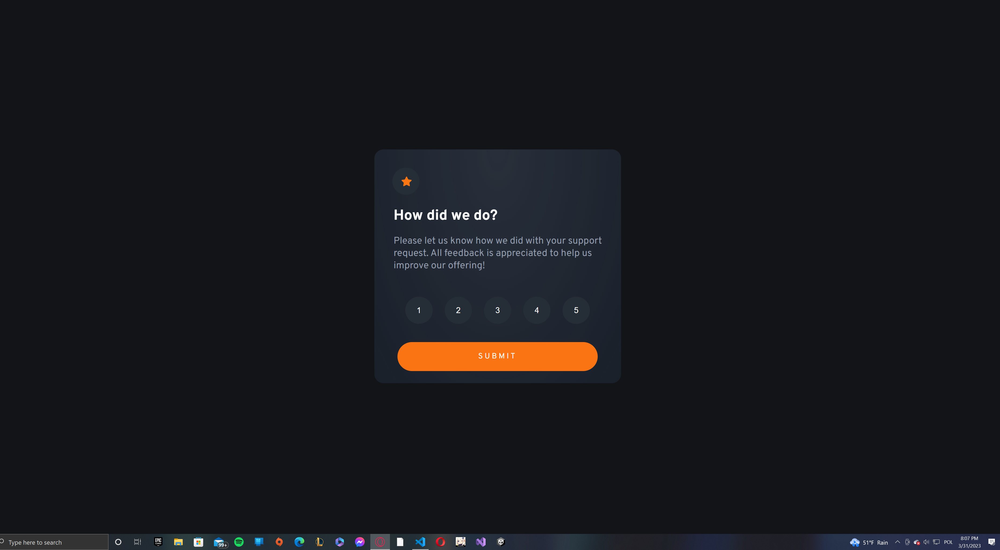
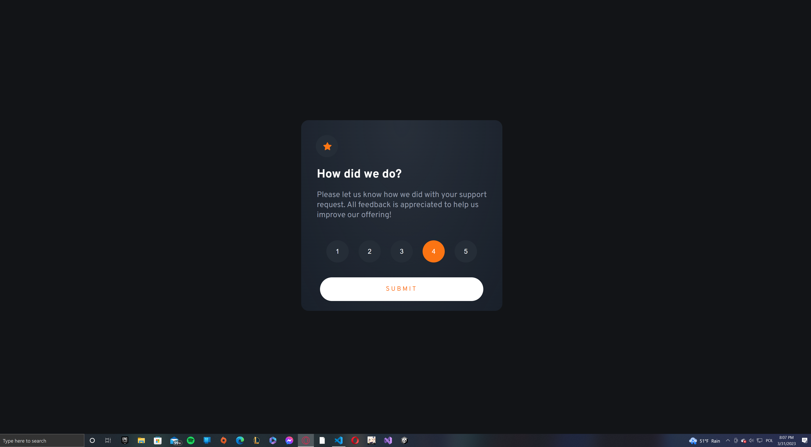
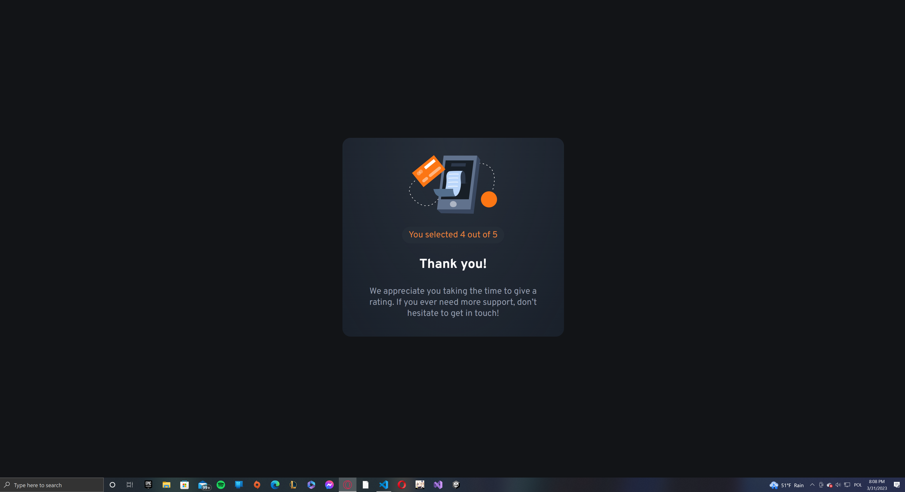
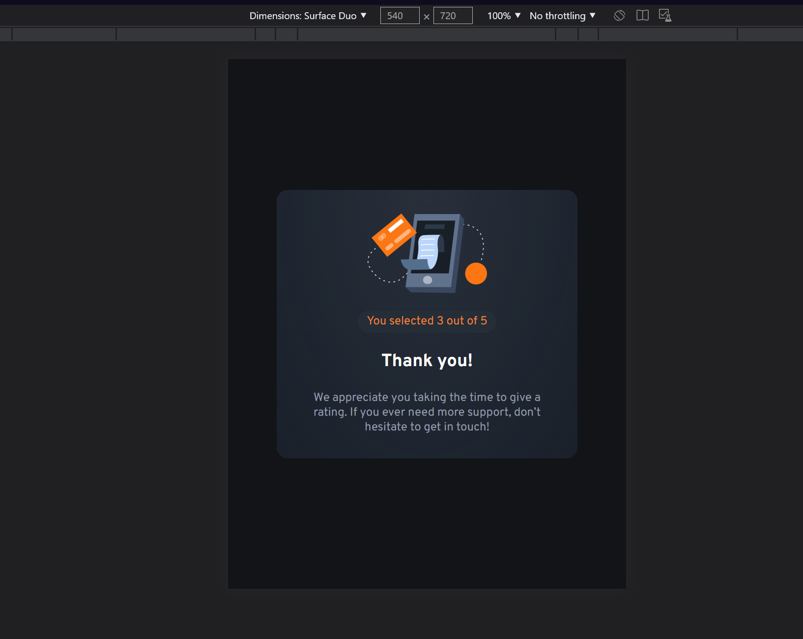
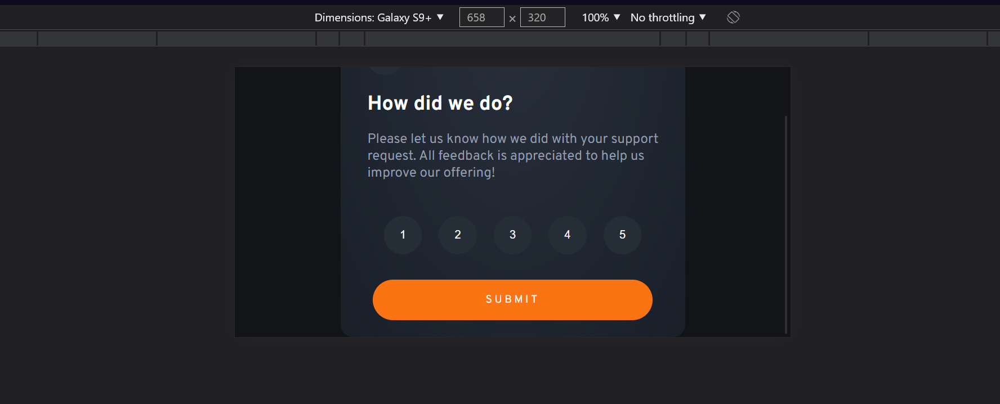

# Interactive rating component

## Welcome! 👋

This is my solution for challenge, full responsive web for any devices. I was making this by use flexbox and JavaScript DOM. I do not see any problem with this website so I am proud of yourself.

[Frontend Mentor](https://www.frontendmentor.io)

[Live Interactive rating component](https://klaudiapalubska.github.io/interactive-rating-component.github.io/)

---

## My design

- Desktops

  
  
  

- Tablets/bigger mobile devices

  

- Smartphones

  

- Smartphones landscape mode

  

---
